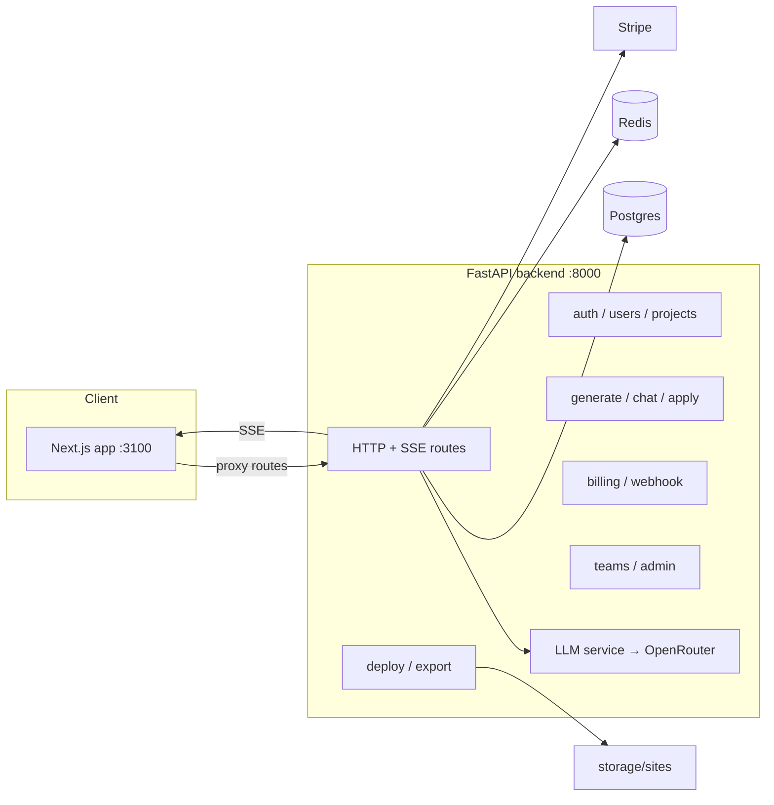

# HydraWeb

**AI-powered website generation and vibe coding** — describe a website in plain English, get a
production-ready site with frontend, backend and database, refine it together with an AI copilot,
and deploy it on your own subdomain.

This is a production-oriented MVP: no stubs, no mock data, real Stripe billing, real auth,
real database migrations, real deployments.

## Features

- **AI website generation** — a prompt becomes HTML/CSS/browser JS, a FastAPI backend, and a
  Postgres schema, streamed to the editor via SSE and saved as a version.
- **Vibe coding** — a chat copilot proposes diffs to your site; review and apply them, or dismiss.
- **Visual editing** — a GrapesJS canvas on top of every generated version.
- **Versioning & rollback** — every generation and applied suggestion is persisted; roll back any time.
- **Deployments** — publish to `{subdomain}.myplatform.dev` (static hosting served from this API).
- **Teams** — owners, editors and viewers share projects.
- **Billing** — Stripe subscriptions (Free / Pro / Enterprise), invoices, customer portal,
  and one-time payments for premium generations.
- **API keys** — `hw_*` keys with per-plan rate limits for programmatic access.
- **Rate limiting** — Redis sliding-window limits per user + path, based on plan.

## Monorepo layout

```
.
├── apps/web/            Next.js 14 frontend (App Router, Tailwind, GrapesJS)
│   ├── app/             Pages + API route handlers (proxy to backend)
│   ├── components/      UI kit, app shell, editor, vibe chat panel
│   └── lib/             api client, SSE streaming, auth, types
├── services/api/        FastAPI backend
│   ├── app/
│   │   ├── routes/      auth, users, projects, generate, deploy, billing, teams, admin
│   │   ├── llm/         OpenRouter streaming + mock fallback
│   │   ├── services/    versions, deploy, export, stripe, rate limiting, email
│   │   └── models.py    SQLAlchemy models (User, Project, Version, Chat, Billing, Teams)
│   ├── alembic/         Migrations
│   └── tests/           pytest suite (SQLite in-memory)
├── infra/               docker-compose for Postgres + Redis
├── .github/workflows/   CI for backend and frontend
└── .env.example         All configuration knobs
```

## Quickstart

Prereqs: Docker, Node 20+, Python 3.12, [uv](https://docs.astral.sh/uv/).

```bash
# 1. Infra (Postgres + Redis)
npm run infra:up

# 2. Backend
npm run api:install
cp .env.example .env          # fill in at least SECRET_KEY, OPENROUTER_API_KEY
npm run api:migrate
npm run api:dev               # http://localhost:8000  (docs at /docs)

# 3. Frontend
npm run web:install
cd apps/web && npm run dev    # http://localhost:3100
```

`LLM_MOCK=true` uses a built-in sample generator so you can try the whole flow without an
OpenRouter key.

## Configuration

Copy `.env.example` to `.env`. Key settings:

| Var | Purpose |
| --- | --- |
| `DATABASE_URL` / `REDIS_URL` | Postgres (asyncpg) and Redis connections |
| `SECRET_KEY` | JWT signing — must match between API and web (`apps/web` also reads `SECRET_KEY`) |
| `OPENROUTER_API_KEY` / `LLM_MODEL` | LLM provider and model |
| `LLM_MOCK` | `true` = offline sample generator |
| `STRIPE_SECRET_KEY` / `STRIPE_WEBHOOK_SECRET` / `STRIPE_PRICE_*` | Stripe billing |
| `PLATFORM_DOMAIN` | Public domain for deployed subdomains (`*.myplatform.dev`) |
| `AUTO_VERIFY_EMAIL` | Skip email verification when no SMTP is configured |

## Testing

```bash
npm run api:test      # 22 pytest cases (auth, projects, generate, billing, versions)
npm run web:build     # Next.js production build
```

Backend lint/typecheck: `cd services/api && uv run ruff check .`

## Architecture



Requests flow: the Next.js app proxies `/api/*` calls to the FastAPI backend, attaching the
httpOnly `hydraweb_token` cookie. SSE streams (`generate`, `chat`) pass through the proxy
untouched. Deployments write static files to `storage/sites/{subdomain}/` which the API serves
at `/s/{subdomain}` (a `*.myplatform.dev` wildcard DNS record points here in production).

## CI/CD

- `.github/workflows/backend.yml` — installs deps, runs `ruff` and `pytest`.
- `.github/workflows/frontend.yml` — `npm ci`, lint, `tsc`, production build.

Deployment is left to your platform of choice: `services/api/Dockerfile` builds the API image;
the frontend can be deployed to Vercel with `API_URL` and `SECRET_KEY` set as environment
variables.
